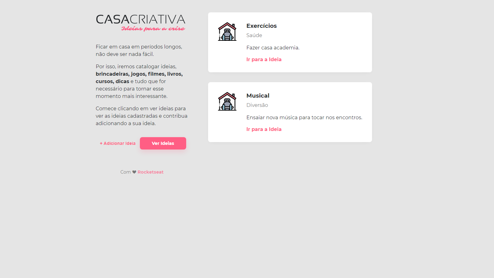
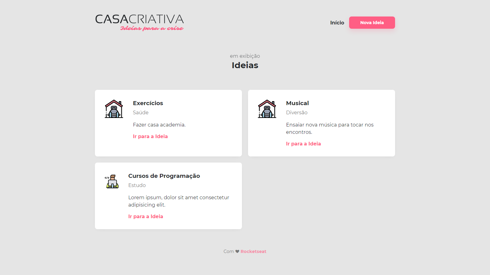
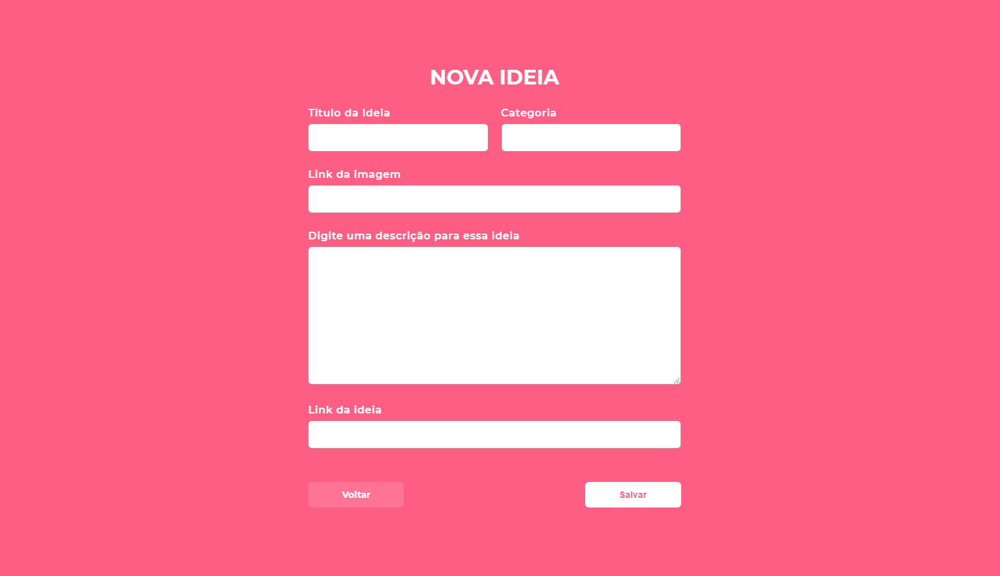

<li align="center">
</img>

</img>

</img>
</li>

<h1 align="center">WorkshopDev Especial</h1>

Projeto <strong>Casa Criativa</strong> desenvolvido durante o WorkshopDev Especial da <a href="https://rocketseat.com.br">Rocketseat</a> 🚀💻

  <a aria-label="Versão do Node" href="https://github.com/nodejs/node/blob/master/doc/changelogs/CHANGELOG_V12.md#12.16.1">
    </img>
  </a>

  <a href="#-instalacao-e-execução">Instalação e execução</a>&nbsp;&nbsp;&nbsp;

## 🚀 Instalação e execução

_ps: Se precisar de ajuda para fazer um clone, esse [tutorial aqui](https://help.github.com/pt/github/creating-cloning-and-archiving-repositories/cloning-a-repository) vai te ajudar 💖_

1. Abra o terminal do seu computador. Se estiver no Windows pode ser o CMD ou Powershell.
2. Altere o diretório (pasta) de trabalho atual para o local em que deseja ter o código do módulo salvo no seu computador.
3. Faça um clone desse repositório rodando:   `git clone https://github.com/tharlysdias/casa-criativa`;
4. Entre na pasta rodando pelo terminal: `cd casa-criativa`;
5. Rode `npm` para instalar as dependências do projeto;
6. Rode `npm run dev` para iniciar o servidor de desenvolvimento.

---

Feito com ♥ by Tharlys Dias :wave:
